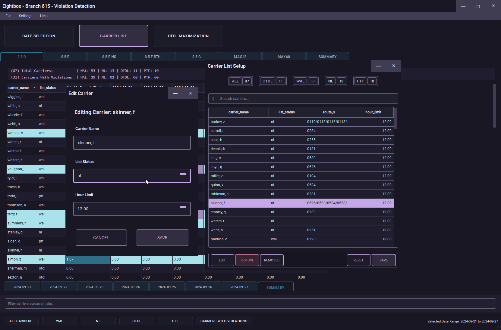

# Eightbox

A Windows desktop application built with PyQt5 for a local union branch to track and analyze carrier violations using data from klusterbox's mandates.sqlite file.


## Features

### Violation Detection
- 8.5.D Violations (Overtime Off Route when OTDL wasn't utilized to their hourly limits)
- 8.5.F Violations (Over 10, Non-Scheduled, 5th Day)
- 8.5.G Violations (OTDL Maximization)
- MAX12 Violations (12-Hour Daily Limit)
- MAX60 Violations (60-Hour Weekly Limit)
- Comprehensive violation summaries with remedy calculations


### OTDL Maximization Checking
- OTDL Maximization tracking and status management
- Carrier excusal system for 8.5.G violations
- Single-click application of changes across multiple dates
- Real-time violation updates when maximization status changes

The screenshots below demonstrate the before and after effects of excusing OTDL carriers from overtime. When an OTDL carrier is excused, it prevents 8.5.D violations for WAL/NL carriers (since the OTDL carrier was unavailable for overtime) and also prevents 8.5.G violations for the excused OTDL carrier.


### Data Management
- Import carrier data from JSON
- Customizable carrier list management
- Removed carriers management with restore functionality
- Date-based violation filtering
- Excel export functionality with consistent carrier name sorting
- Progress tracking for long operations



### User Interface
- Modern PyQt5 interface with Material Dark theme
- Tabbed interface for different violation types
- Global carrier filtering across all tabs
- Comprehensive documentation for all violation types

## Requirements

### Runtime Dependencies
- Python 3.11 or higher
- PyQt5 == 5.15.11 (with Qt5 5.15.2)
- pandas == 2.2.3
- openpyxl == 3.1.5
- numpy == 2.2.0
- xlsxwriter == 3.2.0
- PyGithub == 2.5.0 (for release management)
- sqlite3 (included with Python)

### Development Dependencies
- black == 24.10.0 (code formatting)
- flake8 == 7.1.1 (style guide)
- isort == 5.13.2 (import sorting)
- pre-commit == 4.0.1 (git hooks)
- pylint == 3.3.2 (additional linting)

## Setup

### Prerequisites
1. Install and configure [Klusterbox](https://github.com/TomOfHelatrobus/klusterbox)
   - Alternatively, you can use the test database included in this repository
3. Ensure Klusterbox is working correctly with your data
4. ⚠️ **IMPORTANT**: Always backup your Klusterbox database before use:
   ```
   cd %USERPROFILE%\Documents\.klusterbox
   copy mandates.sqlite mandates.sqlite.backup
   ```
   While Eightbox should not modify your Klusterbox database, it's always wise to have a backup.

### Installation
1. Download the latest release (.7z file) from the GitHub releases page
2. Extract the .7z file to a new folder named `eightbox`
3. Launch `eightbox.exe` from the extracted folder

### Configuration
- Eightbox will automatically:
  - Detect your Klusterbox database location
  - Create its own `eightbox.sqlite` file (a mirror of mandates.sqlite)
  - Sync with mandates.sqlite on startup

### Database Synchronization
Eightbox automatically syncs with Klusterbox's database. If you update data in Klusterbox while Eightbox is running:
1. Go to Settings > Database Path
2. Click "Sync Database" to manually update Eightbox's data

## Test Database
The repository includes a sanitized test database (`fake_mandates_db.sqlite`) that you can use to try out the application without needing real carrier data. This database:
- Contains anonymized carrier names and employee IDs
- Includes sample data for all supported violation types
- Uses generic station names (STATION1, STATION2, etc.)
- Is safe to use and share as it contains no real carrier information

To use the test database:
1. First, backup your existing Klusterbox database:
   ```
   cd %USERPROFILE%\Documents\.klusterbox
   copy mandates.sqlite mandates.sqlite.backup
   ```
2. Copy the test database to the Klusterbox directory:
   ```
   copy path\to\fake_mandates_db.sqlite %USERPROFILE%\Documents\.klusterbox\mandates.sqlite
   ```
3. Launch Eightbox - it will automatically detect the database

You can also use the test database as a template to understand the required schema for your own data.

To restore your original database:
```
cd %USERPROFILE%\Documents\.klusterbox
copy mandates.sqlite.backup mandates.sqlite
```

## Usage

⚠️ **IMPORTANT**: Always verify clock ring information with the Employee Everything Report obtained through a Request for Information (RFI). This report is the source of truth for clock ring data. Never rely solely on the program's violation detection - while the program aims to be accurate, there may be bugs or data inconsistencies that could affect results. Also the remedies are based on the branch settlements and escalated remedies, so they may not be universally applicable.

### Basic Workflow
1. Click on Date Selection
2. Find a date range you want to investigate
3. Setup your carrier list when prompted
4. Configure carrier settings:
   - Set carrier status and hourly limits (primarily for OTDL)
   - Remove carriers from investigation if needed (can be restored via "Removed" button)
   - Click Save (settings stored in `carrier_list.json`)

### Violation Detection
5. The program will analyze the date range for violations
6. OTDL Maximization management:
   - Excuse OTDL carriers who didn't reach their hour limits
   - Apply changes to update violations and remedies

### Data Cleanup (Optional)
7. For detailed analysis, use File > Clean Invalid Moves to fix problematic clock rings:
   - Look for moves > 4.25 hours (possible scanner/editing issues)
   - Check for invalid route numbers (e.g., rt0000)
   - Use Employee Everything Report as reference
   - Click "Save All" to apply fixes

### Export and Documentation
8. Generate reports:
   - File > Generate All Excel Spreadsheets
   - Creates 8 Excel files in `eightbox/spreadsheets/daterange/`
   - Each file includes daily sub-tabs as worksheets
   - Preserves formatting and colors from Eightbox

### Notes
- Tables are read-only to prevent accidental data modification
- Help > Article 8 Violation Formulas Documentation explains detection methods
- Violation detection is based on specific branch settlements and escalated remedies
- MAX60/MAX12 violations may be more universally applicable
- Always verify violations manually as the program's detection is not infallible
- Cross-reference all findings with the Employee Everything Report before taking action
- Remember that this tool is meant to assist in violation detection, not replace human verification

## Development
This project uses:
- black for code formatting
- flake8 for style guide enforcement
- isort for import sorting

### Pre-commit Hooks
The project uses pre-commit hooks to ensure code quality:
- isort: Sorts Python imports
- black: Formats Python code
- flake8: Checks code style
- Conventional Commit: Enforces commit message format

To set up pre-commit hooks:
```bash
pip install pre-commit
pre-commit install
```

## Version History

For a complete list of changes, see [CHANGELOG.md](CHANGELOG.md).

### Recent Changes

### 2024.1.6.6
- Updated test database with more entries
- Added screenshots to documentation
- Updated OTDL maximization documentation
- Updated release workflow documentation

### 2024.1.6.5
- Updated Excel export to use Rose Pine colors consistently
- Improved date selection pane styling
- Updated window and tab styles

### 2024.1.6.4
- Added alternating row background colors to violation tables
- Improved selection highlight visibility in OTDL maximization table
- Moved subtabs below table for better layout flow

# Linux Support
Eightbox now supports Linux systems. The database path is automatically detected at ~/.klusterbox/mandates.sqlite
